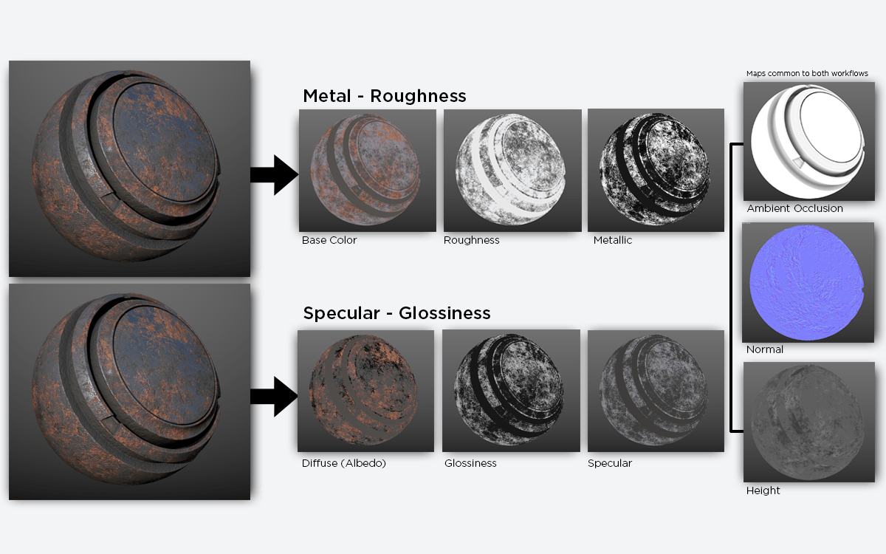
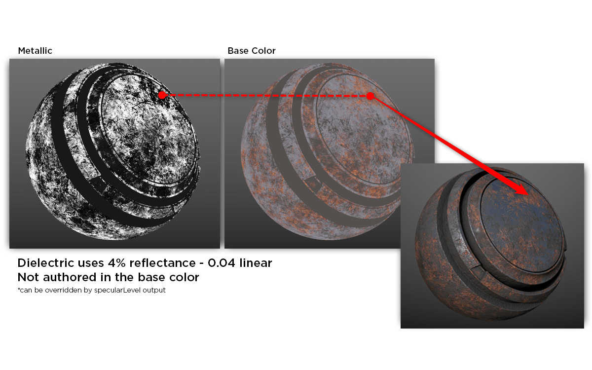
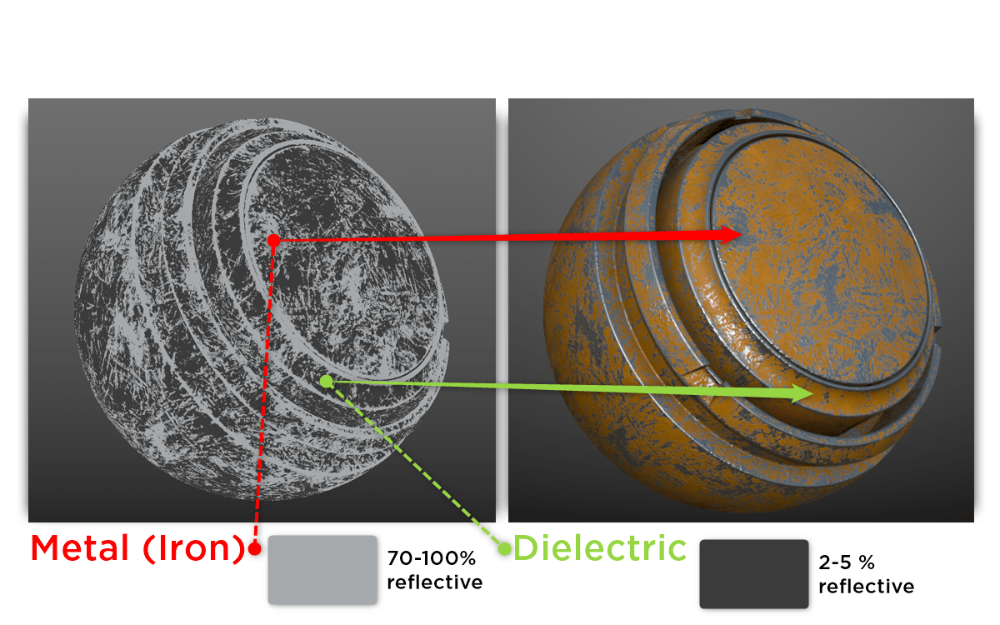

**PBR 材质制作里常见的是两套贴图工作流**：

1. **金属度 / 粗糙度工作流（Metallic / Roughness）**
2. **高光 / 光泽度工作流（Specular / Glossiness）**

## 关于 Base Color、Diffuse 和 Albedo

两套工作流中的 Base Color 与 Diffuse 贴图都会存储非金属部分的 Diffuse Albedo：

- **Base Color** 还会存储金属部分的 $F_0$。
- **Diffuse** 对应的金属部分则是黑色 $(0,0,0)$，$F_0$ 信息交给 Specular 贴图。

所以，Albedo 在实际运用中更像一个泛称，需要结合具体工作流理解。

## Glossiness 和 Roughness

二者描述的是同一类表面属性，方向相反。在使用互补定义的工作流中：

$$
\boxed{Glossiness = 1-Roughness}
$$

下面看看 BRDF 公式中用到 Roughness 的地方。

### 法线分布函数

$$
D_{GGX} = \frac{\alpha^2}{\pi[(N\cdot H)^2(\alpha^2-1)+1]^2}
$$

其中，采用常见的感知粗糙度映射：

$$
\boxed{\alpha=Roughness^2}
$$

### 几何遮蔽函数

引擎中会对相关项进行合并优化。这里用 Schlick 近似的拆分形式，便于理解粗糙度如何参与计算：

$$
G=G_1(V)\,G_1(L)
$$

单个方向的函数写成：

$$
G_1(X)=\frac{N\cdot X}{(N\cdot X)(1-k)+k}
$$

在这里采用的近似中：

$$
\boxed{k=\frac{Roughness^2}{2}}
$$

$N$ 是表面法线，$V$ 和 $L$ 分别指向相机和光源，$H$ 是半程向量；$X$ 代表 $V$ 或 $L$。

关于 UE 历史方案中 $k$ 的写法及粗糙度重映射，可以看我的这篇文章：[几何遮蔽函数](./几何遮蔽函数.md)，以及 Brian Karis 的讲义 [Real Shading in Unreal Engine 4](https://cdn2.unrealengine.com/Resources/files/2013SiggraphPresentationsNotes-26915738.pdf)。

## Metallic、Specular 和 F0

Metallic 贴图是用于区分金属和非金属的灰度遮罩，通常以黑色表示非金属、白色表示金属。

在金属度 / 粗糙度工作流中，普通非金属部分通常默认 $F_0=0.04$。

在 UE 的常规 Default Lit 材质中，也可以设置 Specular 的数值：$0$ 到 $1$ 对应非金属 $F_0$ 的 $0$ 到 $0.08$，默认值 $0.5$ 对应 $F_0=0.04$。默认值的说明可参考 [UE 官方 PBR 材质文档](https://dev.epicgames.com/documentation/en-us/unreal-engine/physically-based-materials-in-unreal-engine#specular)。

---

在高光 / 光泽度工作流中，$F_0$ 由 **Specular RGB 贴图**控制。

### F0 在 BRDF 中的位置

$F_0$ 是光线垂直入射时的镜面反射率，在微表面 BRDF 的 Fresnel 项 $F$ 中出现。这里使用 Schlick Fresnel 近似：

$$
F(\theta)=F_0+(1-F_0)(1-\cos\theta)^5
$$

这里的 $\theta$ 是入射方向与微表面法线之间的夹角；在微表面 BRDF 中，对应与半程向量 $H$ 的夹角。
