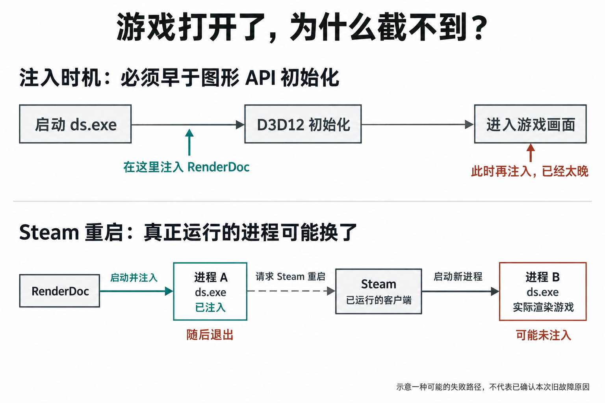
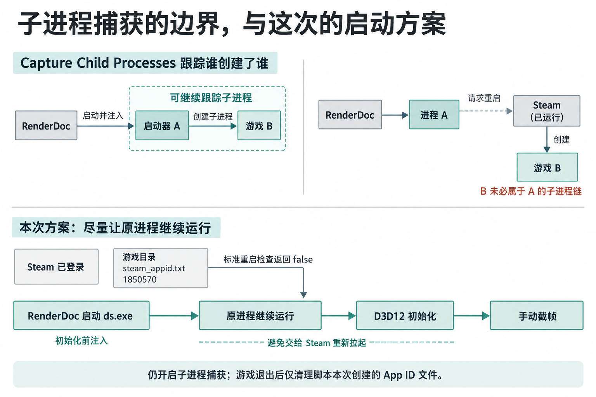

# 用 RenderDoc 截取《死亡搁浅》

对 Steam 版《死亡搁浅：导演剪辑版》进行了抓帧。测试环境为 Windows，游戏使用 D3D12

## 游戏打开了，为什么还是截不到？

RenderDoc 需要把捕获模块**注入游戏进程**，拦截图形 API 调用。这里有个严格的时间要求：注入必须发生在目标图形 API 初始化之前。已经进入游戏画面，再使用 `Inject into Process`，通常就太晚了。[RenderDoc 官方说明](https://github.com/baldurk/renderdoc/blob/v1.x/docs/window/capture_attach.rst)

常见截取不到的原因是进程重启。直接启动 Steam 游戏时，Steam会检查启动环境，然后退出进程，再重新打开游戏。

图中的 A 和 B 虽然都叫 `ds.exe`，却是两个不同的进程。捕获模块进入了 A，不代表也进入了 B。所以，选对 EXE 只是起点，还要确认启动过程中有没有换进程。

## 子进程捕获为什么还不够？

`Capture Child Processes` 会尝试向目标程序创建的子进程继续注入捕获模块，适合“启动器再打开游戏”的情况。

但“子进程”有明确范围，并不等于所有相关程序。Steam 是另一个已经运行的进程，它重新启动的 B 未必属于 A 的子进程链。仅勾选这个选项，不能保证跟上 Steam 的重新启动。

理解这一点，就能把排查落到具体问题上：**谁在渲染，谁启动了它，它是否仍在 RenderDoc 的捕获范围内？**

## 这次怎样让捕获进程保持有效？

我们先退出游戏，保持 Steam 登录，再在游戏目录临时创建 `steam_appid.txt`，内容只有导演剪辑版的 App ID：`1850570`。

这个文件提供游戏身份。按照 Steam 官方机制，存在该文件时，标准的 `SteamAPI_RestartAppIfNecessary` 检查会返回 false，不再要求经由 Steam 重新启动。[Steamworks 官方说明](https://partner.steamgames.com/doc/sdk/api)

随后用 `renderdoccmd.exe capture` 启动 `ds.exe`，工作目录设为游戏文件夹，同时开启 `--opt-hook-children`。这样既尽早注入，也继续跟踪游戏自行创建的子进程。

脚本用 `--capture-file` 固定保存位置，用 `--wait-for-exit` 等待游戏结束，再清理由它本次创建的 App ID 文件。原来已有的文件不会被覆盖或删除。这个做法处理的是 Steam 启动环境，登录和授权仍需满足。

## 截帧失败的坑

最容易犯的错误，是**把“游戏成功打开”当成“RenderDoc 已经注入真正的渲染进程”**。发生 Steam 重启时，屏幕上的游戏照常运行，捕获模块却可能留在已经退出的旧进程中。

另一个误区是先进入游戏，再尝试注入。`Inject into Process` 这个名称容易让人以为随时都能用，但它要求目标图形 API 尚未初始化。此时应退出游戏，改由 RenderDoc 从头启动。

还要避免把子进程捕获当成“自动捕获所有相关程序”。它依赖父子进程关系，不能代替对 Steam 启动链路的检查。

