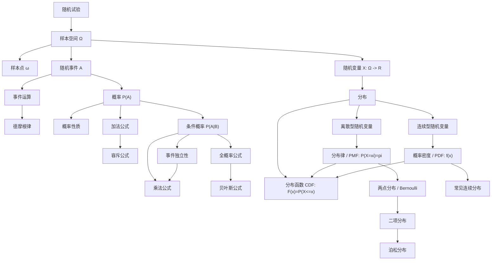
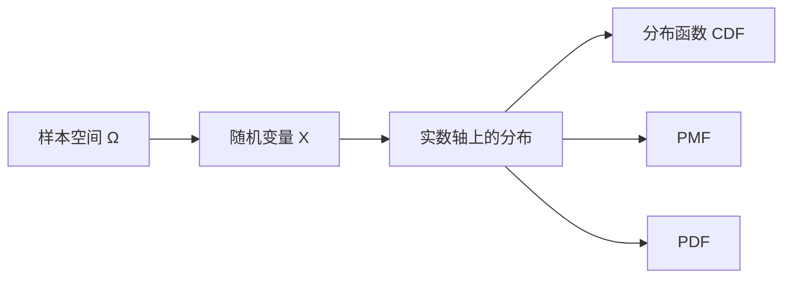
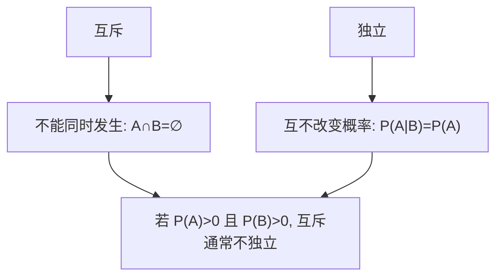
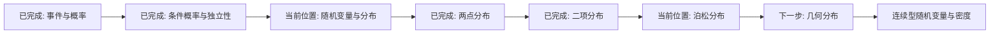

# 概率论概念地图

这张图用来直观看概念之间的逻辑关系。它不是完整知识树，而是当前学习进度内的主干地图。

## 主干关系

## 关键依赖链

### 从随机试验到概率

含义：先明确试验，再列出所有可能结果，然后把某些结果组成事件，最后给事件赋概率。

### 从条件概率到贝叶斯

含义：贝叶斯公式不是孤立公式，它来自条件概率、乘法公式和全概率公式。

### 从事件到随机变量

含义：随机变量把样本空间上的随机结果映射到实数轴，分布描述概率在实数轴上的摆放方式。

## 三组容易混淆的关系

### 互斥 vs 独立

### PMF vs CDF

### PDF vs CDF

## 当前学习位置

